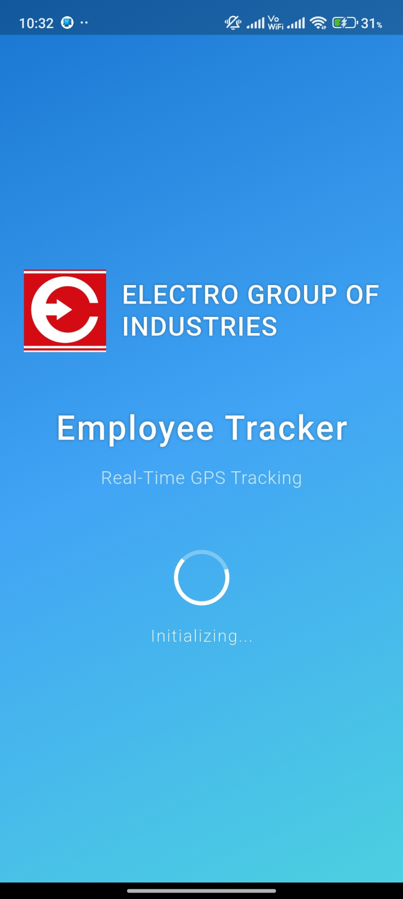
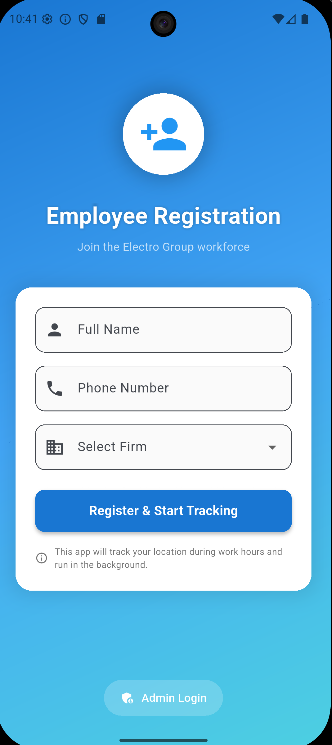
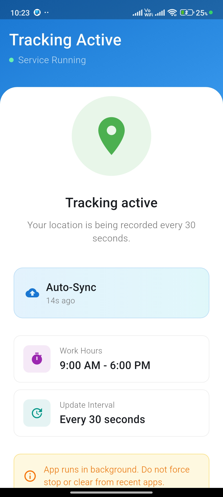
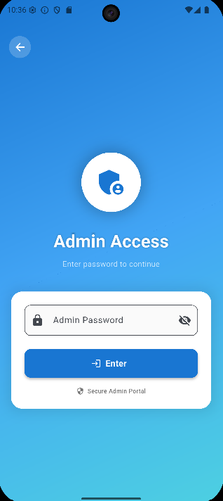
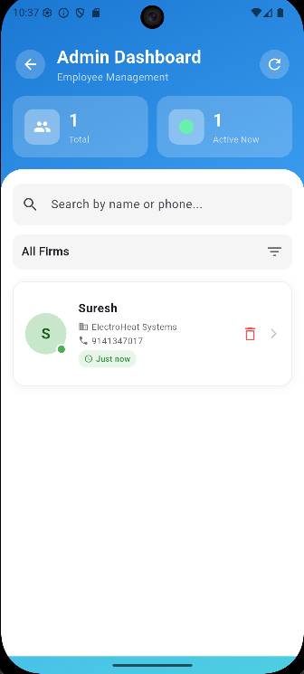
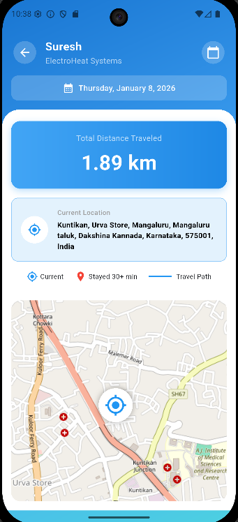

# 📍 Employee Tracker App

A comprehensive Flutter-based mobile application for real-time employee location tracking with admin panel. Built with Supabase backend, this app provides seamless tracking capabilities for both employees and administrators.

## 📋 Table of Contents

- [Screenshots](#-screenshots)
- [Features](#-features)
- [Tech Stack](#-tech-stack)
- [Architecture](#-architecture)
- [Prerequisites](#-prerequisites)
- [Installation](#-installation)
- [Configuration](#-configuration)
- [Usage](#-usage)
- [Project Structure](#-project-structure)
- [License](#-license)
- [Contact](#-contact)

---

## 📱 Screenshots

> Add screenshots of your app in the `assets/screenshots/` folder and link them below

### Employee Features

- 🔐 **Secure Authentication** - Email/password login with Supabase authentication
- 📍 **Real-time Location Tracking** - Automatic location updates in the background
- 🗺️ **Route Visualization** - View daily movement history on an interactive map
- 📊 **Activity Dashboard** - Track work hours, distance traveled, and location history
- 🔔 **Push Notifications** - Alerts for important updates and reminders
- 📱 **Offline Support** - Local data caching with automatic sync when online

### Admin Features

- 👥 **Employee Management** - Add, edit, and remove employee profiles
- 🌍 **Live Location Monitoring** - Real-time tracking of all active employees
- 📈 **Analytics Dashboard** - Comprehensive insights into employee attendance and movement
- 📋 **Distance Measuring** - Generate detailed reports with export capabilities
- 🚨 **Geofencing Alerts** - Notifications when employees enter/exit designated areas
- 📊 **Performance Metrics** - Track productivity and location-based analytics

|                     Splash Screen                      |                       Employee Register                        |                        Employee Dashboard                        |
|:------------------------------------------------------:|:--------------------------------------------------------------:|:----------------------------------------------------------------:|
|  |  |  |

|                    Admin Login                     |                      Admin Dashboard                       |                       Location Tracking                        |
|:--------------------------------------------------:|:----------------------------------------------------------:|:--------------------------------------------------------------:|
|  |  |  |

---

## ✨ Features

---

## 🛠️ Tech Stack

### Frontend
- **Framework**: Flutter 3.5.4+
- **Language**: Dart
- **State Management**: Provider/Built-in State Management
- **UI Components**: Material Design

### Backend & Database
- **Backend**: Supabase
- **Database**: PostgreSQL (via Supabase)
- **Local Database**: SQLite (sqflite)
- **Authentication**: Supabase Auth

### Location & Maps
- **Location Services**: Geolocator
- **Geocoding**: Geocoding Package
- **Maps**: Flutter Map with OpenStreetMap
- **Coordinates**: LatLong2

### Background Services
- **Background Tasks**: Flutter Foreground Task
- **Notifications**: Flutter Local Notifications

### Additional Libraries
- **HTTP Client**: http package
- **Network Monitoring**: Connectivity Plus
- **Device Info**: Device Info Plus
- **Local Storage**: Shared Preferences
- **Date Formatting**: intl
- **Permissions**: Permission Handler

---

## 🏗️ Architecture

The app follows a feature-based architecture with clear separation of concerns:

```
lib/
├── admin/          # Admin-specific features
├── employee/       # Employee-specific features
├── auth/           # Authentication logic
├── core/           # Core utilities and configurations
├── routes/         # Navigation and routing
├── shared/         # Shared widgets and utilities
├── app.dart        # App configuration
└── main.dart       # Entry point
```

---

## 📋 Prerequisites

Before you begin, ensure you have the following installed:

- **Flutter SDK**: 3.5.4 or higher → [Install Flutter](https://docs.flutter.dev/get-started/install)
- **Dart SDK**: Included with Flutter
- **Android Studio** or **VS Code** with Flutter extensions
- **Git**: For version control
- **Supabase Account**: [Create free account](https://supabase.com)

### Platform-Specific Requirements

#### Android
- Android SDK (API level 21 or higher)
- Java Development Kit (JDK) 11 or higher

#### iOS (if developing for iOS)
- macOS with Xcode 12.0 or higher
- CocoaPods

---

## 🚀 Installation

### 1. Clone the Repository

```bash
git clone https://github.com/pranavraok/Employee_Tracker_App.git
cd Employee_Tracker_App
```

### 2. Install Dependencies

```bash
flutter pub get
```

### 3. Set up Supabase

Create a new project on [Supabase](https://supabase.com) and create the following tables:

#### Users Table

```sql
CREATE TABLE users (
  id UUID PRIMARY KEY DEFAULT uuid_generate_v4(),
  email TEXT UNIQUE NOT NULL,
  full_name TEXT,
  role TEXT CHECK (role IN ('admin', 'employee')),
  created_at TIMESTAMP WITH TIME ZONE DEFAULT NOW()
);
```

#### Location History Table

```sql
CREATE TABLE location_history (
  id UUID PRIMARY KEY DEFAULT uuid_generate_v4(),
  user_id UUID REFERENCES users(id),
  latitude DOUBLE PRECISION NOT NULL,
  longitude DOUBLE PRECISION NOT NULL,
  accuracy DOUBLE PRECISION,
  timestamp TIMESTAMP WITH TIME ZONE DEFAULT NOW(),
  address TEXT
);
```

#### Attendance Table

```sql
CREATE TABLE attendance (
  id UUID PRIMARY KEY DEFAULT uuid_generate_v4(),
  user_id UUID REFERENCES users(id),
  clock_in TIMESTAMP WITH TIME ZONE,
  clock_out TIMESTAMP WITH TIME ZONE,
  date DATE NOT NULL,
  total_hours DOUBLE PRECISION,
  status TEXT
);
```

### 4. Configure Environment Variables

Create a configuration file for your Supabase credentials:

```dart
// lib/core/config/supabase_config.dart
class SupabaseConfig {
  static const String supabaseUrl = 'YOUR_SUPABASE_URL';
  static const String supabaseAnonKey = 'YOUR_SUPABASE_ANON_KEY';
}
```

⚠️ **Important**: Add this file to `.gitignore` to keep your credentials secure.

---

## ⚙️ Configuration

### 1. Update AndroidManifest.xml

Add required permissions in `android/app/src/main/AndroidManifest.xml`:

```xml
<manifest xmlns:android="http://schemas.android.com/apk/res/android">
    <uses-permission android:name="android.permission.INTERNET"/>
    <uses-permission android:name="android.permission.ACCESS_FINE_LOCATION"/>
    <uses-permission android:name="android.permission.ACCESS_COARSE_LOCATION"/>
    <uses-permission android:name="android.permission.ACCESS_BACKGROUND_LOCATION"/>
    <uses-permission android:name="android.permission.FOREGROUND_SERVICE"/>
    <uses-permission android:name="android.permission.POST_NOTIFICATIONS"/>
    <uses-permission android:name="android.permission.WAKE_LOCK"/>
</manifest>
```

### 2. Configure App Icon

Replace the app logo at `assets/images/app_logo.png` with your custom icon, then run:

```bash
flutter pub run flutter_launcher_icons:main
```

### 3. Build and Run

```bash
# For Android
flutter run

# For iOS
flutter run -d ios

# For Release Build
flutter build apk --release
```

---

## 📖 Usage

### Employee Workflow

1. **Login** - Open the app and log in with your employee credentials
2. **Clock In** - Tap the "Clock In" button to start your shift
3. **Auto-Tracking** - The app automatically tracks your location in the background
4. **View History** - Check your route history and attendance records
5. **Clock Out** - End your shift by tapping "Clock Out"

### Admin Workflow

1. **Login** - Access the admin panel with admin credentials
2. **Dashboard** - View all active employees and their real-time locations
3. **Manage Employees** - Add new employees or update existing profiles
4. **View Reports** - Access attendance reports and location analytics
5. **Monitor Activity** - Track employee movements and attendance patterns

---

## 📁 Project Structure

```
Employee_Tracker_App/
├── android/                    # Android native code
├── ios/                        # iOS native code
├── assets/
│   └── images/                # App images and icons
├── lib/
│   ├── admin/                 # Admin panel features
│   │   ├── screens/          # Admin UI screens
│   │   ├── widgets/          # Admin-specific widgets
│   │   └── services/         # Admin business logic
│   ├── employee/             # Employee features
│   │   ├── screens/          # Employee UI screens
│   │   ├── widgets/          # Employee-specific widgets
│   │   └── services/         # Employee business logic
│   ├── auth/                 # Authentication
│   │   ├── screens/          # Login/signup screens
│   │   └── services/         # Auth services
│   ├── core/                 # Core functionality
│   │   ├── config/           # App configurations
│   │   ├── constants/        # Constants and enums
│   │   └── utils/            # Utility functions
│   ├── routes/               # Navigation
│   ├── shared/               # Shared components
│   │   ├── widgets/          # Reusable widgets
│   │   ├── models/           # Data models
│   │   └── services/         # Shared services
│   ├── app.dart              # App widget
│   └── main.dart             # Entry point
├── test/                      # Unit and widget tests
├── pubspec.yaml              # Dependencies
└── README.md                 # This file
```

---

## 📝 Note

This application was developed as a **client project** based on specific requirements provided by the client. The features and functionality were implemented according to their exact specifications. While additional enhancements and optimizations could have been made to further improve the application, the current implementation fulfills all the requested requirements and deliverables as outlined by the client.

---

## 👨‍💻 Developer

**Pranav Rao K**

- GitHub: [@pranavraok](https://github.com/pranavraok)
- LinkedIn: [Your LinkedIn Profile](https://www.linkedin.com/in/pranav-rao-k-487532312/)
- Email: pranavraok18@gmail.com

---

## 🙏 Acknowledgments

- Flutter Team for the amazing framework
- Supabase for the backend infrastructure
- OpenStreetMap for map tiles
- All open-source contributors

---

⭐ **If you find this project helpful, please give it a star!**

---

<div align="center">
  Made with ❤️ using Flutter
</div>